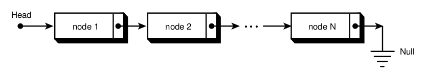

# 0x12. C - Singly linked lists

## Resources
**Read or watch:**

- [Linked Lists](https://youtu.be/udapt4FGY20)
- [Google](https://www.google.com/search?q=linked+lists)
- [Youtube](http://www.youtube.com/results?search_query=linked+lists)

### General Learning Objectives
- When and why using linked lists vs arrays
- How to build and use linked lists

## General Requirements

* Allowed editors: vi, vim, emacs

* All your files will be compiled on Ubuntu 20.04 LTS using gcc, using the options -Wall -Werror -Wextra -pedantic -std=gnu89

* All your files should end with a new line

* A README.md file, at the root of the folder of the project is mandatory

* Your code should use the Betty style. It will be checked using [betty-style.pl](https://github.com/holbertonschool/Betty/blob/master/betty-style.pl) and [betty-doc.pl](https://github.com/holbertonschool/Betty/blob/master/betty-doc.pl)

* You are not allowed to use global variables

* No more than 5 functions per file

* The only C standard library functions allowed are malloc, free and exit. Any use of functions like printf, puts, calloc, realloc etc… is forbidden

* You are allowed to use _putchar

* You don’t have to push [_putchar.c](https://github.com/holbertonschool/_putchar.c/blob/master/_putchar.c), we will use our file. If you do it won’t be taken into account

* In the following examples, the main.c files are shown as examples. You can use them to test your functions, but you don’t have to push them to your repo (if you do we won’t take them into account). We will use our own main.c files at compilation. Our main.c files might be different from the one shown in the examples

* The prototypes of all your functions and the prototype of the function _putchar should be included in your header file called lists.h

* Don’t forget to push your header file

* All your header files should be include guarded

### Files and Description

| File                     | Description                                                                                             |
| ------------------------ | ------------------------------------------------------------------------------------------------------- |
| lists.h                  | Function prototypes                                                                                     |
| 0-print_listint.c        | a function that prints all the elements of a listint_t list.                                            |
| 1-listint_len.c          | a function that returns the number of elements in a linked listint_t list.                              |
| 2-add_nodeint.c          | a function that adds a new node at the beginning of a listint_t list.                                   |
| 3-add_nodeint_end.c      | A function that adds a new node at the end of a listint_t list.                                         |
| 4-free_listint.c         | A function that frees a listint_t list.                                                                 |
| 5-free_listint2.c        | function that frees a listint_t list.                                                                   |
| 6-pop_listint.c          | A function that deletes the head node of a listint_t linked list, and returns the head node’s data (n). |
| 7-get_nodeint.c          | a function that returns the nth node of a listint_t linked list.                                        |
| 8-sum_listint.c          | a function that returns the sum of all the data (n) of a listint_t linked list.                         |
| 9-insert_nodeint.c       | a function that inserts a new node at a given position.                                                 |
| 10-delete_nodeint.c      | a function that deletes the node at index index of a listint_t linked list.                             |
| 100-reverse_listint.c    | a function that reverses a listint_t linked list.                                                       |
| 101-print_listint_safe.c | a function that prints a listint_t linked list.                                                         |
| 102-free_listint_safe.c  | a function that frees a listint_t list.                                                                 |
| 103-find_loop.c          | a function that finds the loop in a linked list.                                                        |
| README.md                | A README file for project info                                                                          |