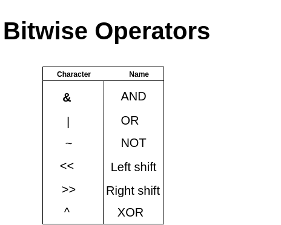

# 0x14. C - Bit manipulation

## Resources
**Read or watch:**
- [Youtube](https://www.youtube.com/results?search_query=bitwise+operators+in+c)
- [Google](https://www.google.com/search?q=bit+manipulation+C)

### General Learning Objectives

* Look for the right source of information without too much help
* How to manipulate bits and use bitwise operators

## General Requirements

* Allowed editors: vi, vim, emacs

* All your files will be compiled on Ubuntu 20.04 LTS using gcc, using the options -Wall -Werror -Wextra -pedantic -std=gnu89

* All your files should end with a new line

* A README.md file, at the root of the folder of the project is mandatory

* Your code should use the Betty style. It will be checked using [betty-style.pl](https://github.com/holbertonschool/Betty/blob/master/betty-style.pl) and [betty-doc.pl](https://github.com/holbertonschool/Betty/blob/master/betty-doc.pl)

- You are not allowed to use global variables

- No more than 5 functions per file

- The only C standard library functions allowed are malloc, free and exit. Any use of functions like printf, puts, calloc, realloc etc… is forbidden

* You are allowed to use [_putchar.c](https://github.com/holbertonschool/_putchar.c/blob/master/_putchar.c)

* You don’t have to push [_putchar.c](https://github.com/holbertonschool/_putchar.c/blob/master/_putchar.c), we will use our file. If you do it won’t be taken into account

- In the following examples, the main.c files are shown as examples. You can use them to test your functions, but you don’t have to push them to your repo (if you do we won’t take them into account). We will use our own main.c files at compilation. Our main.c files might be different from the one shown in the examples

- The prototypes of all your functions and the prototype of the function _putchar should be included in your header file called main.h

- Don’t forget to push your header file

- All your header files should be include guarded

### Files and Description
| File      | Description         |
| --------- | ------------------- |
|0-binary_to_uint.c|function that converts a binary number to an unsigned int.|
| 1-print_binary.c| Function that prints the binary representation of a number.|
| 2-get_bit.c|function that returns the value of a bit at a given index.|
| 3-set_bit| function that sets the value of a bit to 1 at a given index.|
|  4-clear_bit|function that sets the value of a bit to 0 at a given index.|
| 5-flip_bits.c|function that returns the number of bits you would need to flip to get from one number to another.|
| 100-get_endianness.c|Function that checks the endianness.|
| 101-password| Find the password for [this program](https://github.com/holbertonschool/0x13.c).
| main.h    | Function prototypes |
| README.md | README file         |
